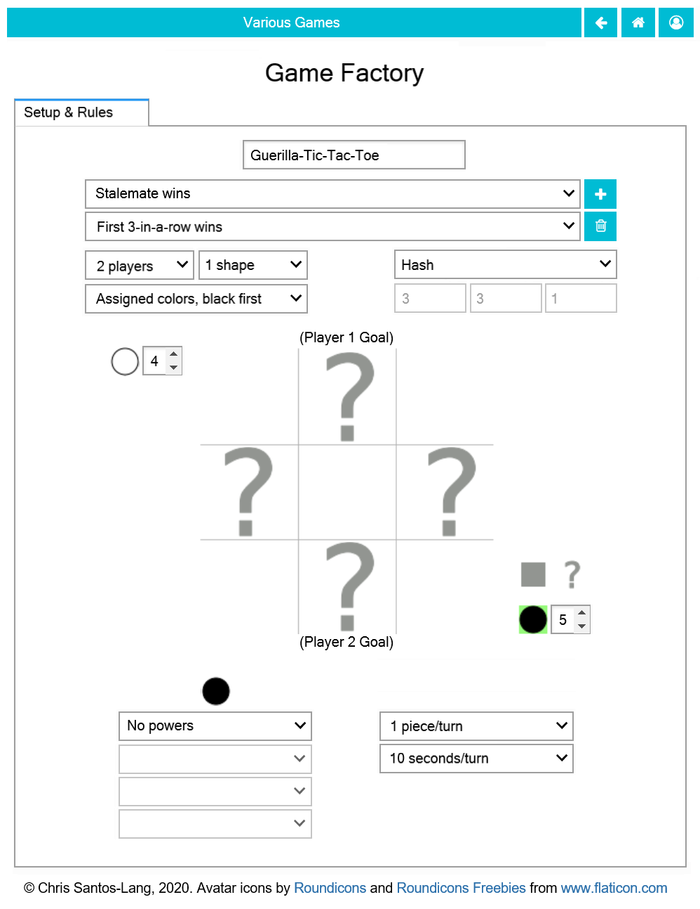

===============
The Game Page
===============

Clicking on a **Leaderboard** button |gamebutton| launches the page for 
the associated game: 

.. image:: releases/images/Leaderboard.png

* The **Leaderboard Tab** provides buttons to see players stats,
  to challenge leaders to play the game, and to create tournaments
* The **Tournaments Tab** provides buttons to see recent tournaments 
  including that game.
* The **Compare Tab** provides buttons to compare games (and design
  a better olympics)

If the game is an *olympics*, then it will have an **Events Tab** with
buttons to launch the page of each event. If the game is an *event*,
then it will have a **Setup & Rules Tab**. Either will have a **Copy**
button you can use to clone the game and adjust it. No two olympics 
can have exatly the same list of events, and no two events can have 
exactly the same rules. 

A copy of an event has editable rules until the creator first leaves
the page. (If you want to edit it after that, just make another copy!)
In addition to specifying reserves and initial piece placement (which 
can include "dealt" pieces), the creator can designate spaces as locked 
(to specific players) and/or "cloaked" (invisibility or obscurity). Each 
phase can be sequential, simultaneous, or single, and can lock specific 
players or spaces, or the options to jump or pass. Various conditions 
may be checked at the end of each turn or phase. Each shape of piece 
can have its own power and way of moving (or not). There can be 
various numbers of boards of various dimensions. There can be various 
numbers of players, or partners, and players may be pitted against 
"chaos", a randomized common-enemy that can test players' ability to 
cooperate. 

Special effort was made to ensure that the range of options would 
permit the construction of all major games of game theory in 
economics. All social behavior can be modelled via such games.

.. |gamebutton| image:: releases/images/gamebutton.png
