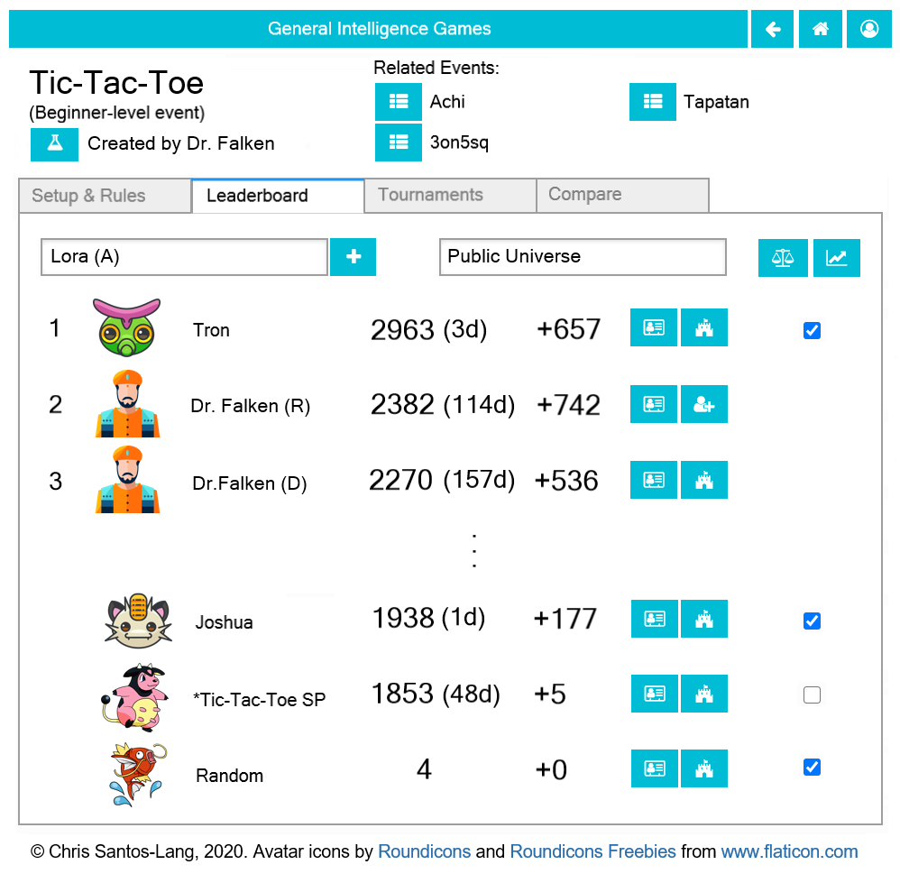

===============
The Game Page
===============

Tic-Tac-Toe is just one of a huge set of possible games, and each 
game has its own **Leaderboard**. Click the |gamebutton| button next
to the name of any game to launch its page: 

* The **Leaderboard Tab** provides buttons to see :doc:`player <player>` 
  stats, to start new matches, and to create new tournaments
* The **Tournaments Tab** provides buttons to see recent 
  :doc:`tournaments <tournament>`
* The **Compare Tab** provides buttons to compare games (and design
  a better olympics)

If the game is an *Olympics*, then it will have an **Events Tab** with
buttons to launch the game page of each event. If the game is an *event*,
then it will have a **Setup & Rules Tab** instead. Either tabe will have 
a **Copy** button you can use to copy the game and 
:doc:`shift the rules <gamefactory>`.

