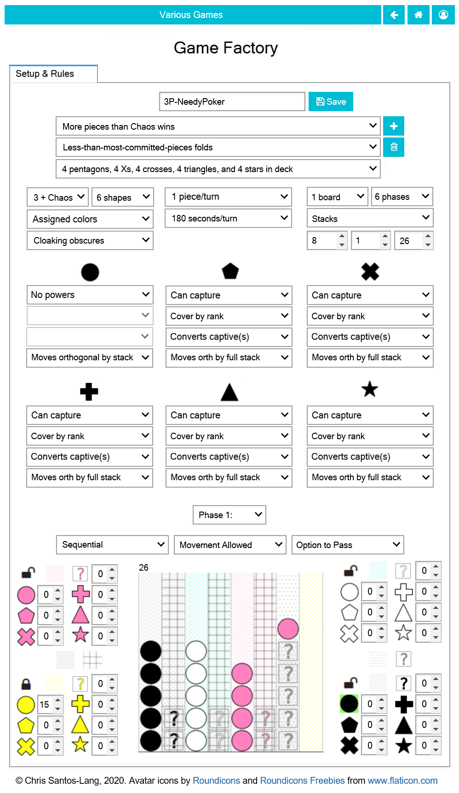

Until a copied :doc:`game <game>` is saved, its rules can be altered:

In addition to specifying reserves and initial piece placement (which 
can include "dealt" pieces), the creator can designate spaces as 
exclusive to specific players or as sticky (no exit). Each 
phase can be sequential, simultaneous, or single, can lock specific 
players and can lock or cloak specific spaces. Each shape of piece 
can have its own power and way of moving (or not). 

A few options deserve special explanation:

* "Fold" rules are checked at the end of each phase. If a player 
  other than "Chaos" folds, then they are locked for the rest of 
  the match (but are still eligible to win)
* Instead of *2 Player*, *3 Player* or *4 Player*, a game can be 
  *Partners* (1st and 3rd vs 2nd and 4th), *2 + Chaos* or 
  *3 + Chaos* where "Chaos" is a randomized common-enemy. *4 Player*
  games can have an "Overachiever(s) disqualified" rule
  that disqualifies the first player(s) identified as winners
  from actually winning
* Instead of the Tic-Tac-Toe *Hash*, the board can be *Squares* of
  various dimension or *Stacks* for which pieces can be placed or
  moved only to/from the tops. Pieces that move "... by stack"
  bring along all pieces above them for the ride. Pieces that move 
  "... by *full* stack" can ony move from the bottom of a stack.
* The effect of capture can be *destroy*, *convert* which changes
  the color, *reincarnate* which add to the captor's reserves,
  or reincarnate (x2) which doubles before adding to the 
  captor's reserves.
* Capturing by "chain-jump" can add moves to the captor's turn.
  Capture by "cover by rank" means the the highest rank of the 
  attackers/defenders captures the other (or they are both 
  destroyed if of equal rank). When pieces that move by stack 
  cover by rank, their rank is that of the entire stack plus any
  communal pieces they cover, ignoring any pieces of the lowest 
  possible rank. highest-5-of-a-shape outranks 
  highest-4-of-a-shape which outranks highest-5-straight which 
  outranks highest-full-house (i.e. three-of-a-shape-plus-pair) 
  which outranks highest-4-straight which outranks 
  highest-3-of-a-shape which outranks highest-2-pair which 
  outranks highest-3-straight which outranks highest-pair 
  which outranks highest-2-straight which outranks 
  highest-singleton
  
Special effort was made to ensure that the range of options would 
permit the construction of all major games of game theory in 
economics. All social behavior can be modelled via such games.
