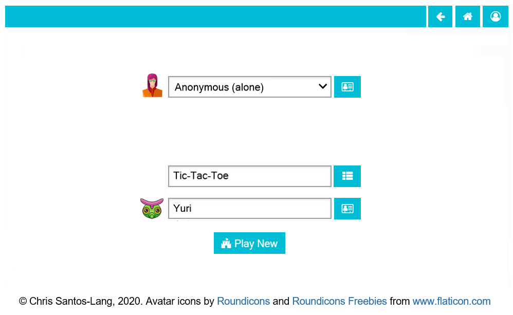

===========
How to Play
===========

If you just want to "kick the tires" then you do not need a user
account. 

As an anonymous user, on the Home page, you can select
a game and other player(s). If you select a way to augment your 
intelligence (i.e. do not play "alone"), then you can also select an
artificial intellience with which to augment your intelligence. 
Clicking the button next to the name of a game or player launches
a page for that game or player where you can see statistics (e.g.
a leaderboard). Clicking the "Play New" button starts the game.

.. toctree::
   :maxdepth: 2

   playground
   player
   game
   tournament
   
