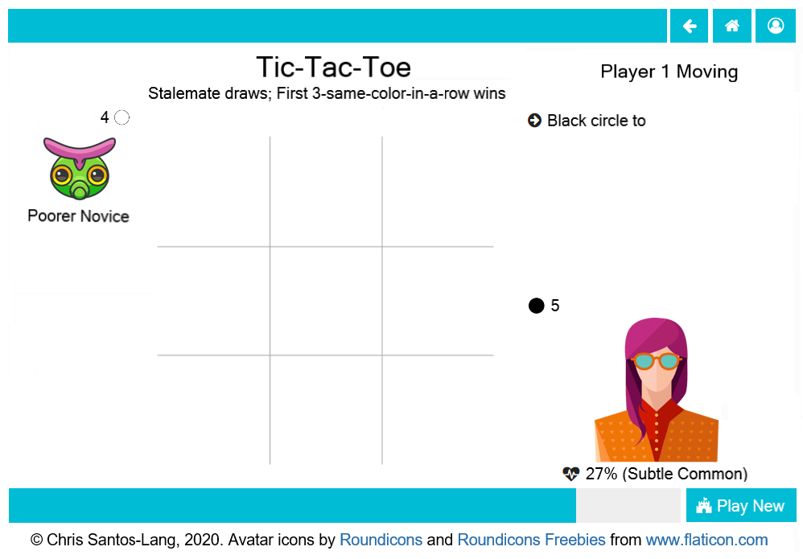

===========
How to Play
===========

If you just want to "kick the tires" then you do not need a user
account. 

.. image:: releases/images/home.png

As an anonymous user, on the Home page, you can select
a game and other player(s). If you select a way to augment your 
intelligence (i.e. do not play "alone"), then you can also select an
artificial intellience with which to augment your intelligence. 
Clicking the button next to the name of a game or player launches
a page for that game or player where you can see statistics (e.g.
a leaderboard). Clicking the "Play New" button starts the game.

On the playground, the other player(s) display on the left with
their color(s) (if assigned). The system summarizes their play history 
by classifying their relative expertise and the degree to which they 
are "owed" favors. Such statistics may be useful to support social 
stategies (but players are free to ignore these labels). 

The board(s) display in the center of the playground. The time bar on 
the bottom indicates the amount of time left in the current turn. 
Depending upon how you choose to augment your intelligence (if at all),
suggestions/calculations may appear on the board. Click the board to 
specify your moves when it is your turn.

Your move selection displays in the upper-right with a button. Click the 
button to accept the move. Depending upon how you 
choose to augment your intelligence (if at all), move(s) may be 
suggested and justifications may be offered. In the lower-right, your 
reserves (if any) display, along with a private randomly-generated 
impulse (useful in strategies that require randomness). Hover over 
pieces in reserve to display rules for those pieces. Hover over 
specially-patterned regions of the board to display special rules for 
those regions. Hover over the rules to preview rules for future phases 
(if any).

For some games (e.g. *Hide and Seek*), different elements are visible 
to different players...

Advancing Social Science
------------------------

Even an anonymous user could help train artificial intelligence by 
playing against it. However, the biggest advances in social science will 
come from inventing new personalities, teams, and games that are in some way 
"better" than those previously known. In a sufficiently diverse field of 
games and players, any particular personality has some game for which that 
personality is a handicap. Understanding various handicaps and ways 
teaming-up can overcome them is the essence of social science (it is not 
just about humans).

Clicking the "Login/Change User" button in the upper right corner allows 
you to login or create a new account. As a logged-in user, you will see 
a "Copy" button on game and player pages. You can click them to create 
new games and players. If your modified versions challenge the rest of the 
user community, then those inventions are advances to social science.

.. toctree::
   :maxdepth: 2

   player
   tournament
   game
