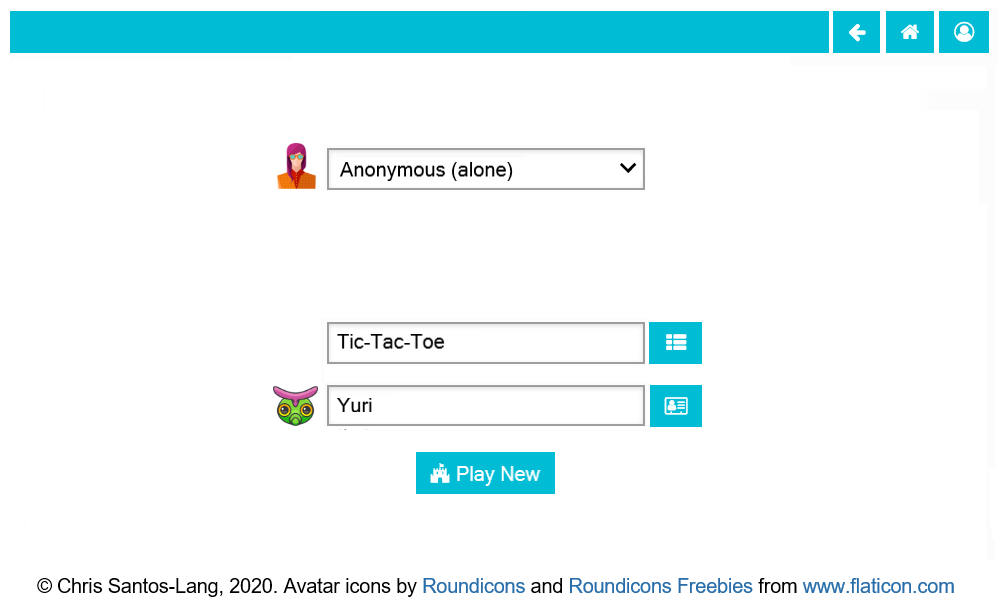

===========
How to Play
===========

If you just want to "kick the tires" then you do not need a user
account. 

As an anonymous user, on the Home page, you can select
a :doc:`game <game>` and other :doc:`player(s) <player>`. If you select 
a way to augment your intelligence (i.e. do not play "alone"), then you 
can also select an :doc:`artificial intellience <playerfactory>` with 
which to augment yourself. Clicking the **Play New** button starts the 
:doc:`match <playground>`.

.. toctree::
   :maxdepth: 2

   playground
   player
   game
   gamefactory
   playerfactory
   tournament
