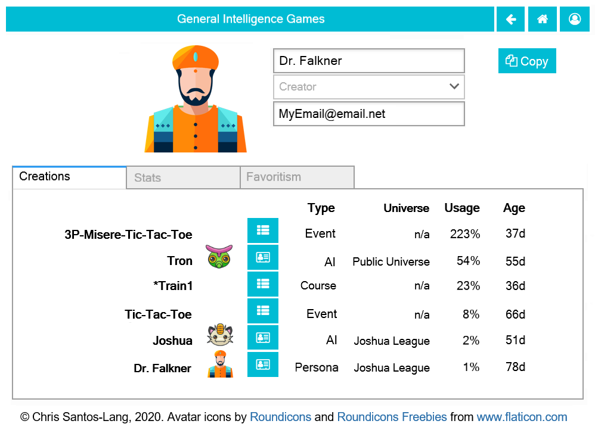

===============
The Player Page
===============

Clicking on a **Player** button |playerbutton| launches the page for that player: 

If it is your own page, then this is where you can change your avatar,
name, and/or email address (which is visible only to yourself and to 
Admins). 

* The **Creations Tab** provides buttons to launch all players and games 
  created by that player.
* The **Stats Tab** provides buttons to challenge the player to 
  play various games 
* The **Favoritism Tab** provides buttons to see opponents' stats

Click the **Copy** button in the upper right corner to create a new 
player. Players created in this way will have no email address, but their
*Type* and *Universe* will be editable until the creator leaves the 
page for the first time. (If you want to edit the *Type* 
or *Universe* of a player after that, just make a new copy!) You can 
make a private leaderboard for a group of friends by copying your own
player to give yourself a Persona in a private Universe, then inviting 
your friends to play against that Persona. In evolution, the effects of 
private universes are important, and called "vicariance".

If the new player is an AI, Team or Corp, then it will have a
**Curriculum Tab** or **Members Tab** instead of a **Creations Tab**:

.. image:: releases/images/CurriculumSimple.png

If you want to alter an AI, you can "fork" it for a given timestamp. 
The new fork will intially be identical (except missing any learning 
after the selected fork). You will be able to edit any of its settings 
until leaving the page for the first time. If an AI is ever harmed 
by learning, you can "rewind" time by forking-off a younger version. 
Another way the creator can alter an AI is to cause *new* learning by 
adding historic games to its curriculum: making it study parts of 
tournaments or parts of other players' history. Its creator can also 
set the AI to learn from its own experiences. 

You can use any AI, Teams of AI, or Corps of AI as a tool to help you
play, so finding the best and making it even better can be a 
powerful way to raise your rankings.

