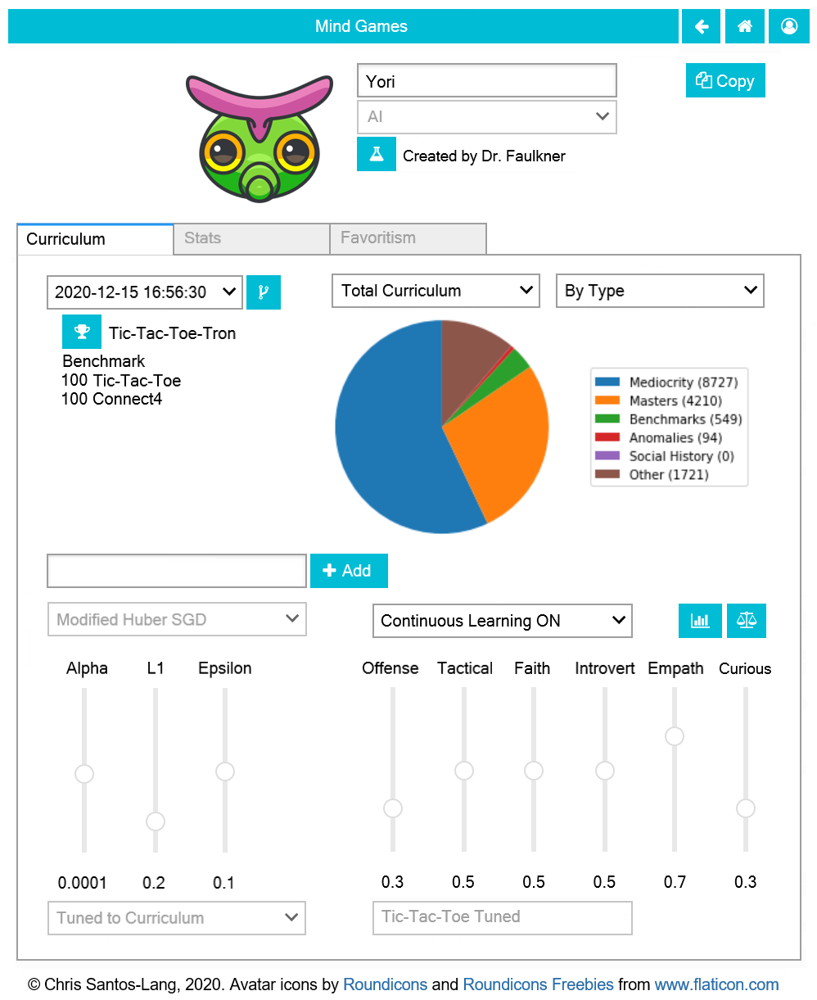

=========================
For Trainers: Creating AI
=========================

Any user can use any *AI*, *Team*, or *Corp* as a tool to help them
:doc:`play <playground>`. On the :doc:`pages <player>` for such tools, 
Trainers see a **Copy** button they can use to duplicate the tool and adjust 
the settings on the new copy to improve it. Finding/creating the best tools 
may be the most powerful way to raise one's :doc:`rankings <game>`.

Many player settings, including *Type* and *Universe*, cannot be changed
once saved. If you want to change those settings, just make a new copy! 

If the player's *Type* is *AI*, then the player page will have a **Curriculum Tab** 
instead of a Creations Tab. Even after an *AI* is saved, its creator
can add recorded matches to its curriculum by specifiying parts of 
tournaments or other players' histories to be studied. Its creator 
can also set the *AI* to automatically learn from its own experiences.
If you ever want a copy of an earlier version of an *AI*, you can "fork"
it from a specified earlier timestamp. 

If the player's *Type* is *Team* or *Corp*, then the player page will
have a **Members Tab** instead of a Curriculum or Creations Tab.
The creator can add *AI* as members, and can delete any members that have 
become obsolete. Each individual *AI* has biases. *Teams* and *Corps* 
leverage diversty of biases. Each regular *Team* fields its highest-ranked
member for each event (i.e. specialists). In a *Corp*, multiple *AI* may 
collaborate on each decision via various forms of government.
