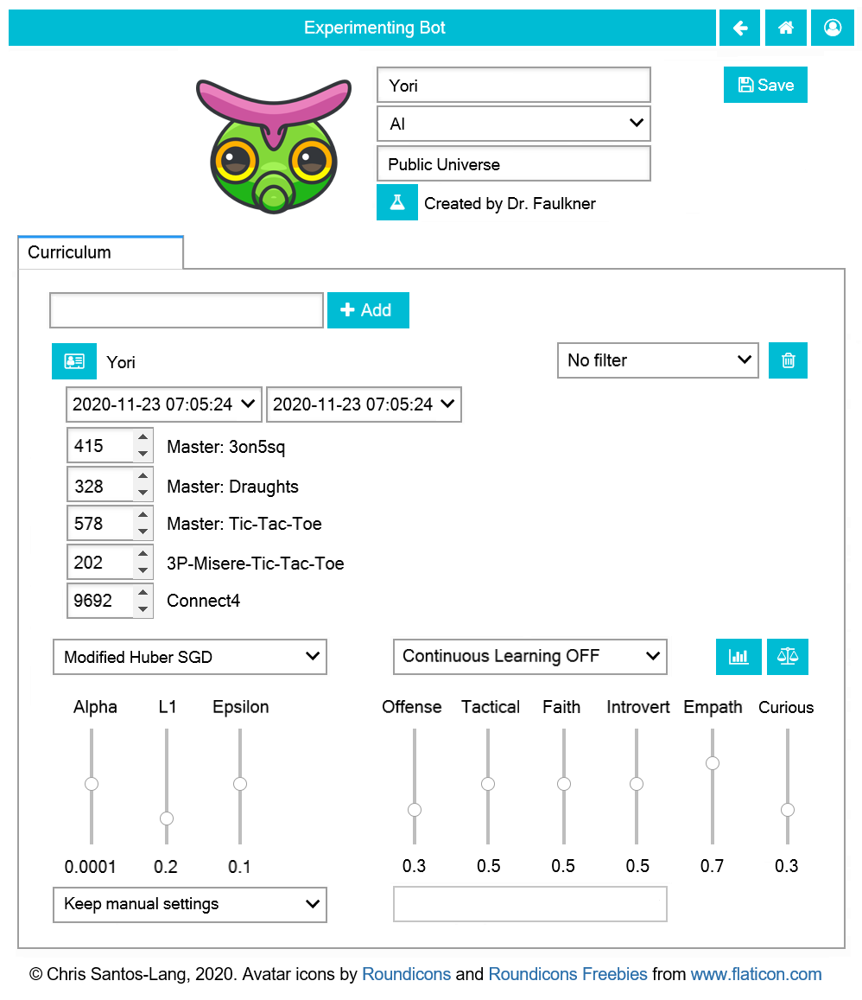

=========================
For Trainers: Creating AI
=========================

Any user can use any *AI*, *Team*, or *Corp* as a 
:doc:`tool to help them play <play>`, but only Trainers see a **Copy** button on the 
:doc:`page <player>` of each such tool to create a duplicate which 
that Trainer can adjust (until it is saved). Finding/refining the best tools 
may be the most powerful way to raise one's :doc:`rankings <game>`.

Many player settings, including *Type* and *Universe*, cannot be changed
once saved. If you want to change those settings, just make a new copy! 
If you ever want a copy of an earlier version of an *AI*, you can "fork"
it from a specified earlier timestamp. 

*AI* players have a **Curriculum Tab** 
instead of a Creations Tab. Even after an *AI* is saved, its creator
can add recorded matches to its curriculum by specifiying parts of 
tournaments or of other players' histories to be studied. Its creator 
can also set the *AI* to automatically learn from its own experiences.
Until the *AI* is saved, its Trainer 
can also set its learning algorithm, parameters for that algorithm, and the 
following (or the Trainer can set them to auto-tune to a given curriculum 
or game):

:math:`\text{Offense}` (opposite: Defense):
  :math:`1.0` means maximize wins (considers draw as bad as loss); 
  :math:`0.0` means minimize losses (considers draw as good as win);
  :math:`0.5` values draw halfway between win and loss 
  
:math:`\text{Tactical}` (opposite: Stategic):
  :math:`1.0` means prioritize the current game; :math:`0.0` means maximize 
  ones own skill-rating. 
  :math:`\text{Tactical}` greater than :math:`\text{Offense}` means 
  never sacrifice a current win to seek future wins; 
  :math:`\text{Tactical}` greater than :math:`(1 - \text{Offense})` 
  means never take a loss to seek future wins

:math:`\text{Faith}` (opposite: Skeptical):
  :math:`1.0` means confidence in one's data never decays; :math:`0.0` means 
  confidence expires instantly; between :math:`0.0` and :math:`1.0`, confidence 
  in ones data depends upon the age of that data
    
:math:`\text{Introvert}` (opposite: Extrovert):  
  :math:`1.0` means practice on simulations as much as possible before acting; 
  :math:`0.0` means learn only via action (so as not to become an "echo chamber")

:math:`\text{Empath}` (opposite: Projective):  
  :math:`1.0` means try to predict others’ moves based on their stats and recent 
  behavior; :math:`0.0` means expect others to do whatever you 
  would do in their situation

:math:`\text{Curious}` (opposite: Practical):  
  :math:`1.0` means to focus practice towards unpracticed scenarios; :math:`0.0`
  means to focus practice towards expected scenarios (see :math:`\text{Empath}`) 

If the player is a *Team* or *Corp*, then the player page will
have a **Members Tab** instead of a Curriculum Tab or Creations Tab.
Its creator can add *AI* to the members, and can delete any members that have 
become obsolete. Each individual *AI* has biases, but *Teams* and *Corps* 
leverage diversty of biases. Each *Team* fields a single member for each 
event (i.e. specialists), but multiple members of a *Corp* collaborate 
on each decision (via various forms of government).
