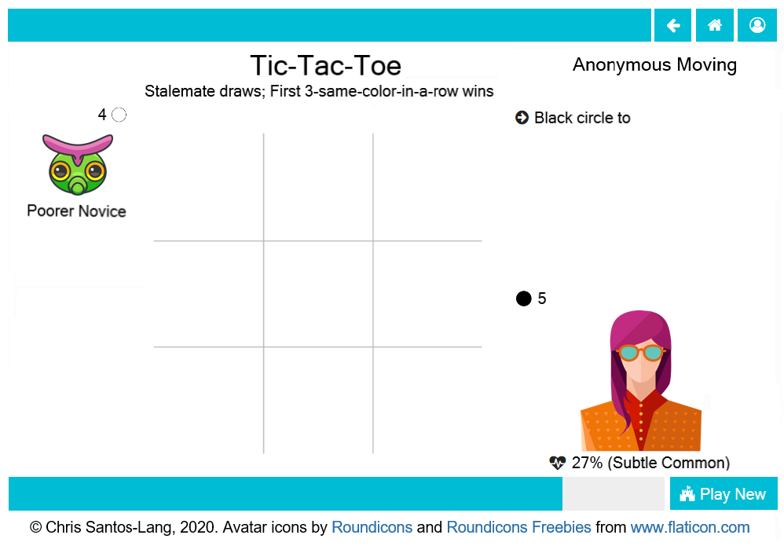

================
Playground Pages
================

On the playground page, the other :doc:`player(s) <player>` display on 
the left (with their colors, if assigned). The system summarizes their 
play history by classifying their relative expertise and the degree to which they 
are "owed" favors. Such classification may be useful to support social 
stategies (but players are free to ignore the labels, if they wish). 

The board(s) display in the center of the playground. The time bar  
below it indicates the amount of time left in the current turn. 
Depending upon how you choose to 
:doc:`augment your intelligence <playerfactory>` (if at all),
calculations may appear on the board along with suggested
moves and justifications. Any augmenting AI will move for you,
if you run out of time. 

Click the board to enter/change your move(s) 
when it is your turn. A player cannot move a placed piece if that 
player has an identical piece in reserve and cannot attempt to place 
a piece from reserves to a location that the player knows is occupied. 
Otherwise, each game has its own :doc:`rules <gamefactory>`.

Your move selection displays in the upper-right with a button. Click the 
button to accept the move. In the lower-right, your 
reserves (if any) display, along with a private randomly-generated 
impulse (useful in strategies that require randomness). Hover over 
pieces in reserve to display rules for those shapes. Hover over 
patterned regions of the board to display special rules for 
those regions. In games with multiple phases, hover over the displayed 
rules on top to preview rules for future phases.

At the end of each match, the estimate of your skill-level for the
:doc:`game <game>` you played will be revised.

.. note::  Unlike with physical board games, different elements could 
  be visible to different players in some games (e.g. *Hide and Seek*).
