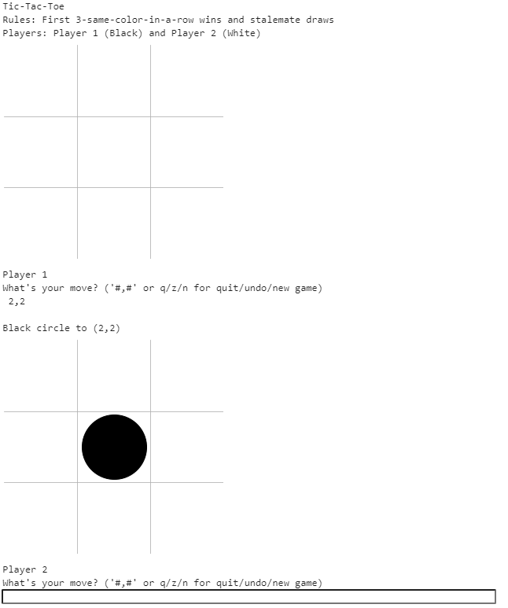

============================
1.0 Command Line Tic-Tac-Toe
============================

Requirements
------------

*(Various words are underlined in this first set of requirements to 
give a sense of what an ontology would have to include. Note that 
it would have to include more than what is bolded here!)* 

Write a program that allows two **humans** (sharing the same keyboard) 
to play **Tic-Tac-Toe** at the **command prompt**, with **options** 
at any point to **quit**, **undo the last move**, or 
**start a new game**. Randomize the order of the **players** at the 
beginning of each new **game**. If a player has only one legal 
**move**, then choose it automatically (so the other player doesn’t 
have to wait). If a player has no legal move, automatically **pass**. 
Detect when a player repeats the exact same move facing the exact same 
**board**--this will be called “**stalemate**” and happens in 
Tic-Tac-Toe only when the board is full (so both players 
automatically pass).

The program should contain the following **rules** as a **constant**, 
and the rules should determine how **play** proceeds: 

* Played on **hash** (**3,3**)
* **2-Player**
* **Assigned Colors**
* **Circle**: 5 **black** and 4 **white** start in **reserve**
* **First 3-same-color-in-a-row** **wins**
* Stalemate **draws**

In general, a game move is either a pass, a 
**request to call it a draw**, **agreement**/**rejection** of such a 
request, a **jump** from **one spot** to **another**, or a 
**placement** from reserves of a given **shape** and **color** to a 
spot on the board. The rules of Tic-Tac-Toe permit players to choose 
only moves of the last type and to only specify “to” coordinates, 
since all pieces in that player’s reserves will be of the same shape 
and color, but design your code to evolve support for other games 
(e.g. other-dimensional boards, other kind of pieces/cards, etc).
 
Acceptance Test Plan
--------------------

Test that the program works. Confirm that it does not permit illegal 
moves, and that it recognizes draws and all kinds of wins (e.g. 
horizontal, vertical, upward-slanting-diagonal, and 
downward-slanting-diagonal). After finishing a game, confirm that 
you can roll back the choices using undo. Also confirm that you can 
end the game or restart at any time.

Potential Mockups
-----------------

Command Line Interface::

  pip install redscience
  redscience tic-tac-toe

   Each move adds a new section to the bottom...

