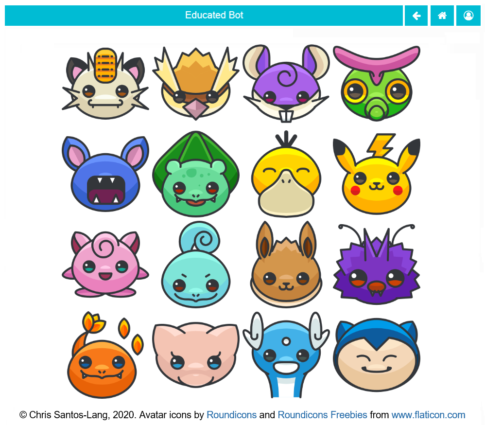
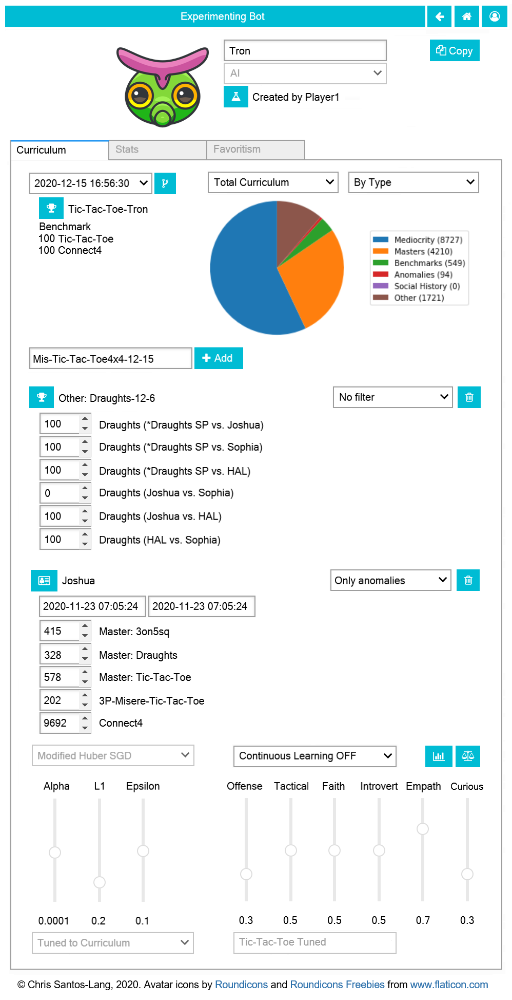
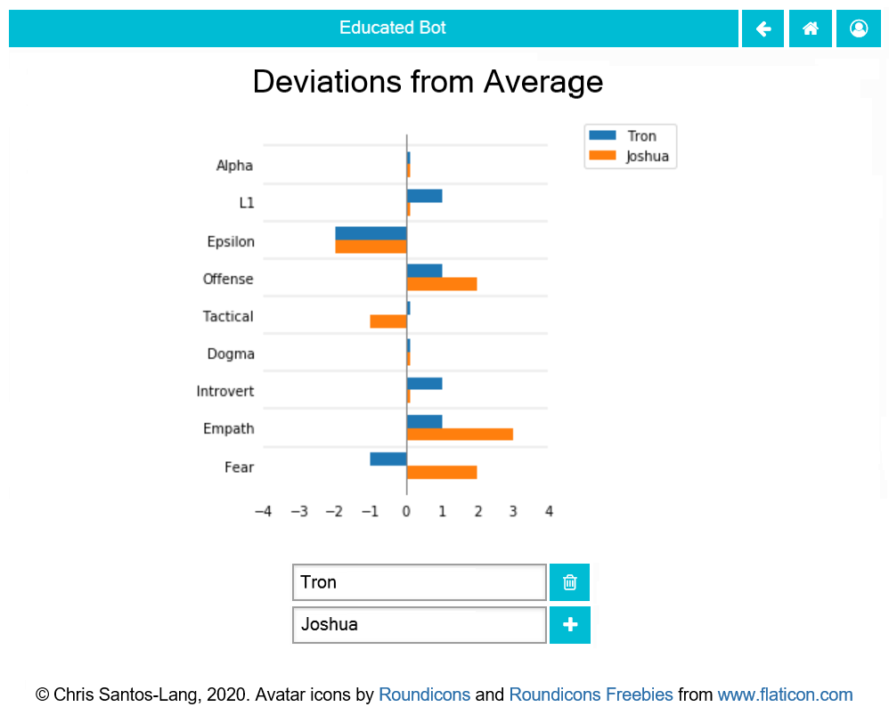
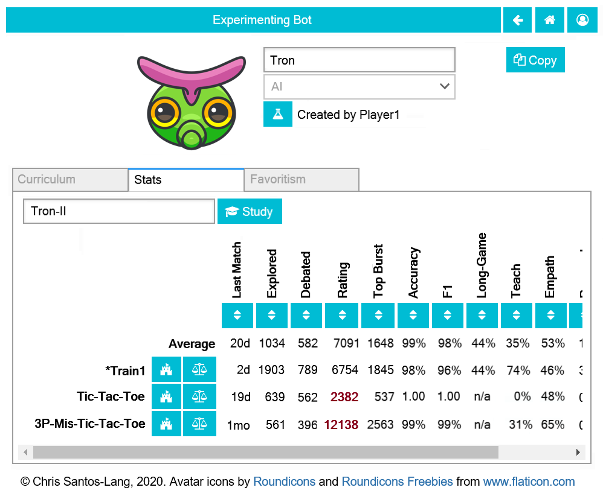

===============
1.8 Educated AI
===============

Requirements
------------

Modify the Game Data Generator program to permit Trainers and 
Admins to create players of type="AI". 

When creating an AI users must select a machine learning 
“classifier” that supports partial_fit (from Python's scikit-learn 
module), set parameters for that algorithm, set initial curriculum, 
and set the Offence, Tactical and Faith “personality” parameters. 
Also allow Trainers and Admins to add pending curriculum by 
selecting tournaments or curriculum from other AI to be studied. 
To “fork” an AI at a curriculum point other than total means to 
create a new AI with the same parameters and have it study the 
curriculum of the original AI up to that point. An AI with 
pending curriculum is unavailable to play and will automatically 
“complete” its pending curriculum before participating in any 
tournament. This means it will run any unrun tournaments in its 
pending curriculum, update the Last Match stat for any game with 
more recent match in the curriculum, and apply the partial_fit 
method of its machine learning algorithm to each move in the 
curriculum learn to classify moves as “win”, “unstrategic_win”, 
“lose”, “strategic_lose”, “draw”, “unstrategic_draw”, “teach”, 
or “actual” given the “game state” of the move (the last two 
labels will be introduced in :doc:`introspection`). For the 
purposes of learning, the game state includes the state of the 
board, the rules of the game, the player’s impulses, the social 
flags for the other players, and type of play (always “explore” 
until :doc:`introspection`) 

To propose moves, AI players apply their algorithm to the game 
state that would result from each possible legal move to give 
each a score (based on the probabilities of each outcome via 
CalibratedClassifierCV), then chooses randomly from the moves 
with the highest score (if more than one). 

Learning Curves
~~~~~~~~~~~~~~~

When recording a move, also record its predicted outcome (to facilitate calculation of accuracy, F1, and learning curves). Add Accuracy, F1 and Long Game for its last 100 predictions to the Stats of AI players, and allow users to launch plots of their learning curves. 

Automation Threshold
~~~~~~~~~~~~~~~~~~~~

Permit users augmented as “Reviewing” or “Debating” to see the score for each legal To, and to specify a score threshold; the proposed move is selected automatically if its score exceeds the threshold. 

Sensitivity Analysis
~~~~~~~~~~~~~~~~~~~~

Permit users augmented as “Reviewing” or “Debating” to see a sensitivity analysis for each selected move: For each property of the game state (space occupations, space locks, player types, impulses), calculate how much the score for that move would shift if that property shifted, then display the properties with the largest shifts.

Formulae
--------

Offense (vs Defence)
~~~~~~~~~~~~~~~~~~~~

:math:`\text{Offense}` :
  :math:`1.0` means maximize wins; :math:`0.0` means minimize losses
  
.. math::
   \text{tScore}_x = 
     & \text{Offense} [ P(win \lor unstrategic win \mid x) ] \\
     & - (1 - \text{Offense}) [ P(loss \lor strategic loss \mid x) ]

Tactical (vs Strategic)
~~~~~~~~~~~~~~~~~~~~~~~

:math:`\text{Tactical}` :
  :math:`1.0` means prioritize the current game; :math:`0.0` means maximize rating; 
  :math:`\text{Tactical}` greater than :math:`\text{Offense}` means 
  never sacrifice a current win for future wins; 
  :math:`\text{Tactical}` greater than :math:`(1 - \text{Offense})` 
  means never take a loss for future wins
  
.. math::
   \text{sScore}_x = 
     & P(win \lor strategic loss \mid x) ] \\
     & - P(loss \lor unstrategic win \lor unstrategic draw \mid x)  
  
Faith (vs Skeptical)
~~~~~~~~~~~~~~~~~~~~

:math:`\text{Faith}` :
  :math:`1.0` means confidence never decays; :math:`0.0` means confidence expires 
  instantly
  
:math:`t_x` :
  The number of days since the most recent occurance of game
  state :math:`x` in the curriculm
  
:math:`\text{score}_x` :
  How much the classifier recommends moving to game state :math:`x`
  
.. math::
  \text{score}_x = 
    \text{Faith}^\frac{\ln (t_x + 20)}{3}
    [ \text{Tactical} (\text{tScore}_x) 
    + (1 - \text{Tactical}) (\text{sScore}_x) ]

Metrics
~~~~~~~

:math:`\text{tCount}_{a, g, n}` :
  The number of tactically-correct predictions by classifier 
  :math:`a` among the 100 predictions or game :math:`g` ending 
  with move :math:`n`

:math:`\text{accuracy}_{a, g, n}` :
  The tactical accuracy of classifier :math:`a` at predicting 
  the outcomes of game :math:`g` as of move :math:`n`

.. math::
  \text{accuracy}_{a, g, n} = \frac{\text{tCount}_{a, g, n}}{100}
    
:math:`\text{F1}_{a, g, n}` :
  The F1 of classifier :math:`a` at predicting 
  the outcomes of game :math:`g` as of move :math:`n`

.. math::
  \text{F1}_{a, g, n} = 
  \frac{2 (\text{tCount}_{a, g, n})}{\text{tCount}_{a, g, n} + 100}  
     
:math:`\text{sCount}_{a, g, n}` :
  The number of strategically-correct predictions by classifier 
  :math:`a` among the 100 predictions or game :math:`g` ending 
  with move :math:`n`
       
:math:`\text{long game}_{a, g, n}` :
  The F1 of classifier :math:`a` at predicting the strategic
  outcomes of game :math:`g` as of move :math:`n`

.. math::
  \text{long game}_{a, g, n} = 
  \frac{2 (\text{sCount}_{a, g, n})}{\text{sCount}_{a, g, n} + 88}   
  
       
Acceptance Test Plan
--------------------

Test each of the clickable elements and test that it displays 
appropriate errors for invalid entries. Create and benchmark the 
following sets of players against random and against each other:

* One AI for each algorithm and using with the existing Random 
  3on5sq 500 tournament plan
* One AI for each algorithm and using a 3on5sq tournament between 
  your best existing players
* Using the best techniques you have found thus far, create AIs 
  to intelligently play 3on15line, Tic-Tac-Toe, and five more 
  complicated games
  
View the learning curves for these AI to get a feel for which 
algorithms are best, how much learning is needed and the relative 
difficulty of different games. Play against your best player on 
its best game to confirm that you can see how it analyzes each 
move. Create two forks of this player: one after all learning and 
one before all learning. Confirm that the first performs just as 
well as the player and that the second performs no better than random.

Potential Mockups
-----------------

To export AI::

  redscience player {name} -e {file}
  
To import AI::

  redscience player {name} -i {file} {security token}
  

AI Avatar Page
~~~~~~~~~~~~~~

* Opens in the place of the “Human Avatar Selection Page” if 
  player type is “AI.
* Clicking an Avatar navigates back to the player page with the 
  avatar replaced with the selected avatar

Curriculum Tab
~~~~~~~~~~~~~~

* The history dropdown (empty until first save) offers the 
  timestamps of all tournaments already learned plus the creation 
  of the AI. Default to the most recent timestamp. Selecting a 
  timestamp displays information about the selected tournament
  below the dropdown (including a “Show Tournament” button); if
  creation date, simply display “Created”.
* The “Fork Player” button (fa-code-fork) saves the current record, 
  and opens a new player which is identical except it doesn’t have 
  the same name and does not include any pending tournaments or any 
  history timestamped after the fork.
* The “Show Tournament” button (fa-trophy) saves the current record 
  and opens the associated tournament 
* The pie_filter dropdown offers “Total Curriculum” (default) and 
  each rule set learned.
* The pie_categories dropdown offers “By Type” (default) and “By 
  Game” (it can be expanded to “By Cluster” in 
  :doc:`generalintelligence`)
* The pie_chart displays the number of moves studied that pass the 
  filter, breaking down by category
  
  * “Anomalies” yielded strategic losses, unstrategic wins and 
    unstrategic draws
  * “Masters” are non-anomalous moves on the curriculum for 
    studying players rated within one standard deviation of the 
    top, 
  * “Mediocrity” are non-anomalous moves on the curriculum for 
    studying players not rated within one standard deviation of 
    the top, 
  * “Benchmarks” are non-anomalous moves on the curriculum for 
    studying Benchmark tournaments
  * “Social History” are non-anomalous moves on the curriculum 
    for studying Social tournaments
  * “Other” are any other moves learned (i.e. from tournaments 
    that do not qualify as Benchmarks or Social)
* The add_tournament combobox offers a list of all tournaments. 
  Defaults to blank.
* The “Add Tournament” button adds the selected tournament 
  immediately below (with “Show Tournament” button, “Delete 
  Tournament” button, and games integer selects
* One “Delete Tournament” button (fa-trash-o) shows for each 
  selected tournament that has not yet been learned. It deletes 
  the associated tournament and all of its matchups. 
* One matches integer select shows for each matchup in each 
  selected tournament that has not yet been learned. It offers 
  integers from zero to the total number of matches for that 
  matchup. Default to all matches (if less learn the most 
  recent). If a tournament is selected with no matchups, display 
  “(no games)”.  
* The “Benchmark” button (fa-balance-scale) is available to 
  Trainers and Admins. It saves the current record and navigates 
  to the Leaderboard tab of the Game Factory page of the rule set 
  most common among the pending tournaments (or in the most recent 
  Curriculum timestamp). Checkboxes will be checked for this AI, 
  the player it is most Favored By, Random, the top player, the 
  player it is most Favored By, (and the standard if available).
* The algorithm dropdown offers “Naive Bayes”, “Perceptron”, 
  “Passive Aggressive I”, “Passive Aggressive II”, “Linear SVM”, 
  “Logistic Regression”, and “Modified Huber SGD”. Default to 
  “Logistic Regression.” Disabled after learning begins.
  
  * If “Naive Bayes”, fit priors and display slider for smoothing 
    (default 1.0)
  * If “Perceptron”, use Constant learning (eta0=1) with 
    ElasticNet and display sliders for Alpha (default 0), and L1 
    (default 0.15)
  * If “Passive Aggressive I” or “Passive Aggressive II”, display 
    slider for c (default 1.0)
  * If “Linear SVM”, use Constant learning (eta0=1) with ElasticNet 
    and display sliders for Alpha (default 0.0001), and L1 (default 
    0.15)
  * If “Logistic Regression”, use Constant learning (eta0=1) with 
    ElasticNet and display sliders for Alpha (default 0.0001), and 
    L1 (default 0.15)
  * If “Modified Huber SGD”, use Constant learning (eta0=1) with 
    ElasticNet and display sliders for Alpha (default 0.0001), L1 
    (default 0.15), and Epsilon (default 0.1)
* The smoothing slider displays below the algorithm dropdown for 
  Naive Bayes: range 0.0 - 3.0; step 0.3. Disabled after learning 
  begins.
* The alpha slider displays below the algorithm dropdown for 
  Perceptron, Linear SVM, Logistic Regression, and Modified Huber 
  SGD: range 0.0000 - 0.0003; step 0.00003, Disabled after learning 
  begins. 
* The l1_ratio float slider displays below the algorithm dropdown 
  for Perceptron, Linear SVM, Logistic Regression, and Modified 
  Huber SGD: range 0.0 - 1.0 (1.0 means pure L1, 0.0 means pure 
  L2); step 0.1. Disabled after learning begins.
* The c slider displays below the algorithm dropdown for Passive 
  Aggressive I and II: range 0.0 - 3.0; step 0.3. Disabled after 
  learning begins.
* The epsilon slider displays below the algorithm dropdown for 
  Modified Huber SGD: range 0.0 - 0.3; step 0.03. Disabled after 
  learning begins. 
* The continous_learning dropdown offers “Continuous Learning On”, 
  “Continuous Learning Off” (default), and “Always Learn Losses”. 
  Disabled until :doc:`teachable`. 
* The offense slider is disabled after learning begins: range 
  0.0 - 1.0; step 0.1; default 0.5 
* The tactical slider is disabled after learning begins: range 
  0.0 - 1.0; step 0.1; default 0.5 
* The faith slider is disabled after learning begins: range 
  0.0 - 1.0; step 0.1; default 0.5
* The introvert slider is disabled 0 until :doc:`introspection` 
  and after learning begins: range 0.0 - 1.0; step 0.1 
* The empath slider is disabled 0 until :doc:`introspection` and 
  after learning begins: range 0.0 - 1.0; step 0.1 
* The curious slider is disabled 0 until :doc:`introspection` and 
  after learning begins: range 0.0 - 1.0; step 0.1 
* The curriculum_tuning dropdown offers “Keep manual settings” or 
  “Tune to curriculum”. Disabled until :doc:`teachable`
* The rules_tuning combobox offers “Keep manual settings” and the 
  name of each Rule Set followed by “Tuned”. Disabled until 
  :doc:`teachable`

Profile Page
~~~~~~~~~~~~

  
Stats Tab (Revised)
~~~~~~~~~~~~~~~~~~~

* The “Study” combobox and button (fa-graduation-cap) is available 
  to Trainers and Admins. It saves the current record, opens the 
  Curriculum of the player selected in the combobox, and adds this 
  player’s full experience (this player’s own curriculum plus any 
  additional moves made by or against this player) the pending 
  Curriculum (use back button to undo). Default the combobox to 
  the study option most recently selected by the user.

Potential Schema
----------------

