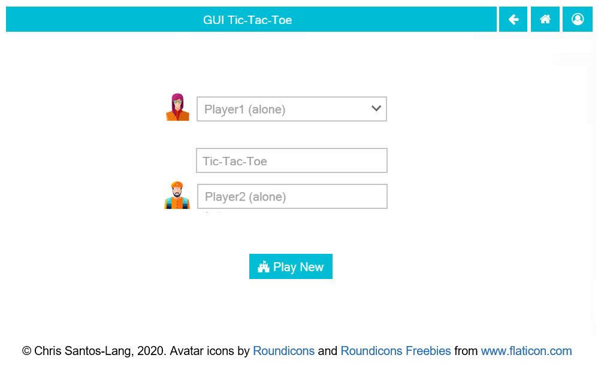
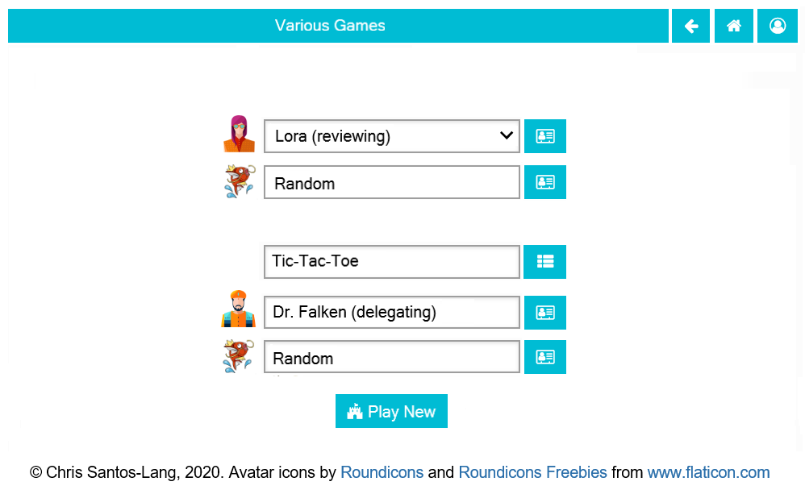
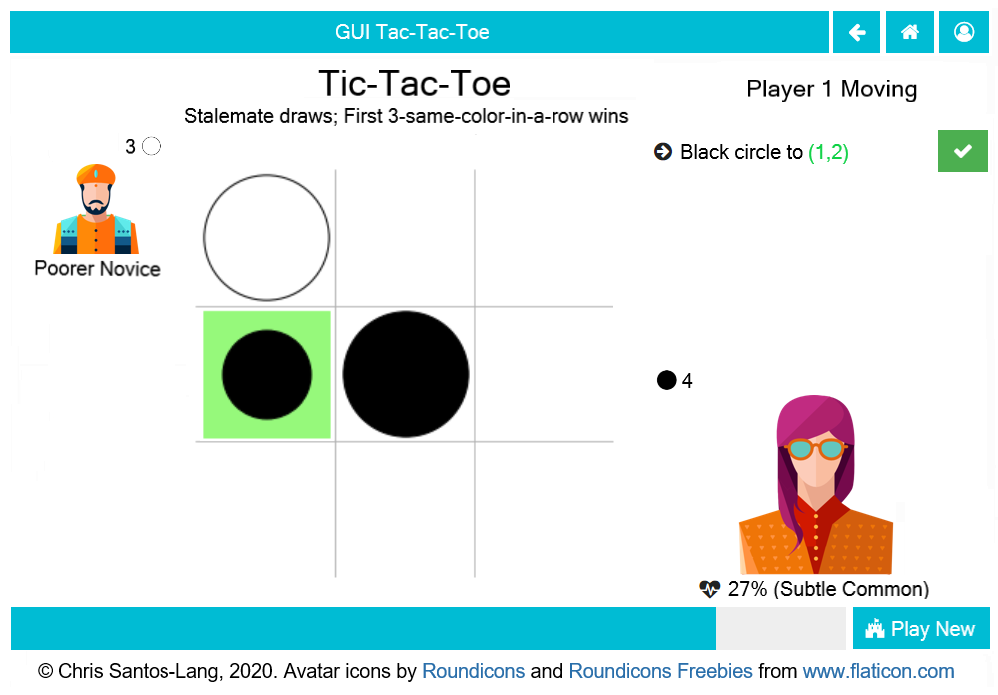
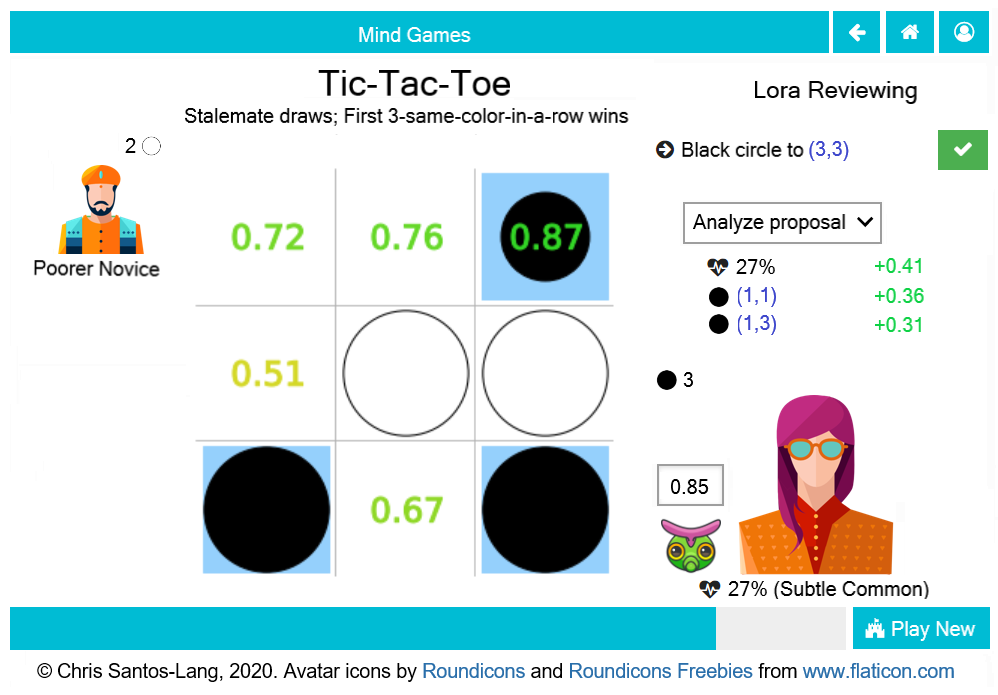

===================
1.1 GUI Tic-Tac-Toe
===================

Requirements
------------

Adapt the Command Line Tic-Tac-Toe to work entirely with the mouse. 
Require separate clicks to select a move (at which point the move 
displays highlighted as "proposed"), and to accept it. Add a 
count-down timer that resets to one minute every time the turn 
changes and automatically accepts the proposed move when the minute 
is up. Any player who does not select their move before the timer 
runs out, or who leaves the playground before the game is complete, 
loses. In addition to displaying the name of the game being played, 
display its rules (piece-specific rules like ability to move or 
capture can be displayed via tooltip). 

Impulses
~~~~~~~~

Randomly assign each player two private impulses: Subtle vs. Basic 
(33.333% frequency) and Rare vs Common (20% frequency). Having private 
impulses provides strategic advantage in games for which opponents 
could exploit predictability; we level the playing field by making 
them available to all players.
 
Acceptance Test Plan
--------------------

Test each of the clickable elements and test that it displays 
appropriate errors for invalid entries

Potential Mockups
-----------------

To start from command line:: 

  redscience
  
Home Page
~~~~~~~~~

   Shown as of GUI Tic-Tac-Toe Version
   

   Shown as of :doc:`games` Version (to anticipate the 
   evolution of the page)
   
* The “Go Back” (fa-arrow-left, style=info) button navigates to 
  the previously open page (if any). 
* The “Go Home” (fa-home) button navigates to the Home Page 
  (already there). 
* The “Login/Change User” button (fa-user-circle-o) ends the 
  session (after :doc:`secure` Version, it will navigate to the 
  Change User page)
* The comboboxes prefill the most recent selections by the user 
  and the top five options are the user’s most recent five 
  selections. Where the user’s personas appear in the comboboxes, 
  they appear with each possible augmentation. If the user has 
  personas with the same name, also display the universe. If an 
  augmentation other than “alone” is selected, an associated 
  augmentor combobox appears.
* The “Show Leaderboard” button (fa-th-list) navigates to the 
  Leaderboard tab of the associated Game
* The augmentation dropdown offers options naming the user with 
  each available augmentation. It defaults to Anonymous (alone) 
  for anonymous users and to the user’s most recent selection for 
  other users. If an augmentation other than “alone” is selected, 
  an associated augmentor combobox appears.
* The “Show Player” button (fa-address-card-o) navigates to the 
  Stats tab of the associated Player
* The “Play New Game” button (fa-fort-awesome) navigates to the 
  Playground Page.
   
Playground Page
~~~~~~~~~~~~~~~

  Shown as of GUI Tic-Tac-Toe Version
  

  Shown as of :doc:`introspection` Version (to anticipate the 
  evolution of the page)

* The name of the player with the current tuurn displays in the 
  upper right along with the form of augmentation ("Moving" if not 
  augmented).
* Recommendations by an augmenter (and spaces cited in justification)
  are highlighted in blue. Exclusive spaces have a diagonal pattern 
  in the color(s) to which they are exclusive. Locked spaces are 
  covered with a grid; sticky spaces are coverd with dots; cloaked 
  spaces are hovered with a haze. If the augmentation is “Reviewing” 
  or “Debating” and the augmenting AI predicts probabilities, then 
  those scores display over each legal "To" for the active move. 
* The avatars and assigned colors of the other players are shown 
  in order of play (next player first). If there are no invisible 
  spaces, then also display the total count of each other player’s 
  reserves. For the user, however, show count by shape, and allow 
  the user to see rules specific to that shape as tooltips. The 
  display of impulses are indicated by icons (fa-heartbeat). 
* The bar on the bottom of the page changes to gray as the time 
  runs out. If the user has prefilled a move, but has not accepted 
  it, then it will automatically be accepted when the clock runs 
  out; otherwise, the player who let the clock run out loses.
* The active move is indicated by an arrow (fa-arrow-circle-right).
  If multiple moves are permitted in a turn, then default to the 
  last move; clicking the text of an inactive move sets it to 
  active. If piece-type/color can be edited, then clicking the 
  text of the active move toggles its piece-type/color. Clicking 
  a piece in the reserve will change the piece-type/color of the 
  active move to match.
* If “From” can be edited, then clicking on a piece that can be 
  moved changes the “From” of the active move to those coordinates 
  (or the coordinates of the top piece of the stack), covers the 
  “From” with a green X, clears all subsequent moves and the “To” 
  of the active move, and highlights all possible “To” coordinates 
  in green. If the user is not playing with “Delegated” 
  augmentation, this will also disable “Accept Move”.
* If the “From” of the active move is already specified or cannot 
  be edited, then clicking any legal “To” coordinates changes the 
  “To” of the active move to those coordinates and places a small 
  piece highlighted in green at the clicked coordinates. If that 
  leaves all moves fully specified, then it enables “Accept Move”. 
  Otherwise, it sets the active move to the next 
  not-fully-specified move.
* Clicking a proposed move on the board (small highlighted piece) 
  clears its “To” and any subsequent moves. If the user is not 
  playing with “Delegated” augmentation, this will also disable 
  “Accept Move”.
* If the augmentation is “Reviewing” or “Debating” and the 
  augmenting AI predicts probabilities, then the threshold float 
  select appears above the avatar of the augmenting AI (default
  to the value most recently selected by the user for that 
  augmentor and game), and an analysis select displays under the 
  moves. Display the sensitivity analysis if the analysis select 
  is set to analyze the proposal. 
* If the user is augmented by a team, then clicking the icon of 
  the bot will toggle the explorer to a different bot in the team 
  (or toggle the debater if debating).
* The “Accept Move” button (fa-check, style=success) advances the 
  turn. If the move is not fully specified (i.e. the user is 
  playing with “Delegated” augmentation), then the non-human player 
  fills the gaps. The contents of selected cloaked spaces are 
  revealed only after the selections are accepted.
