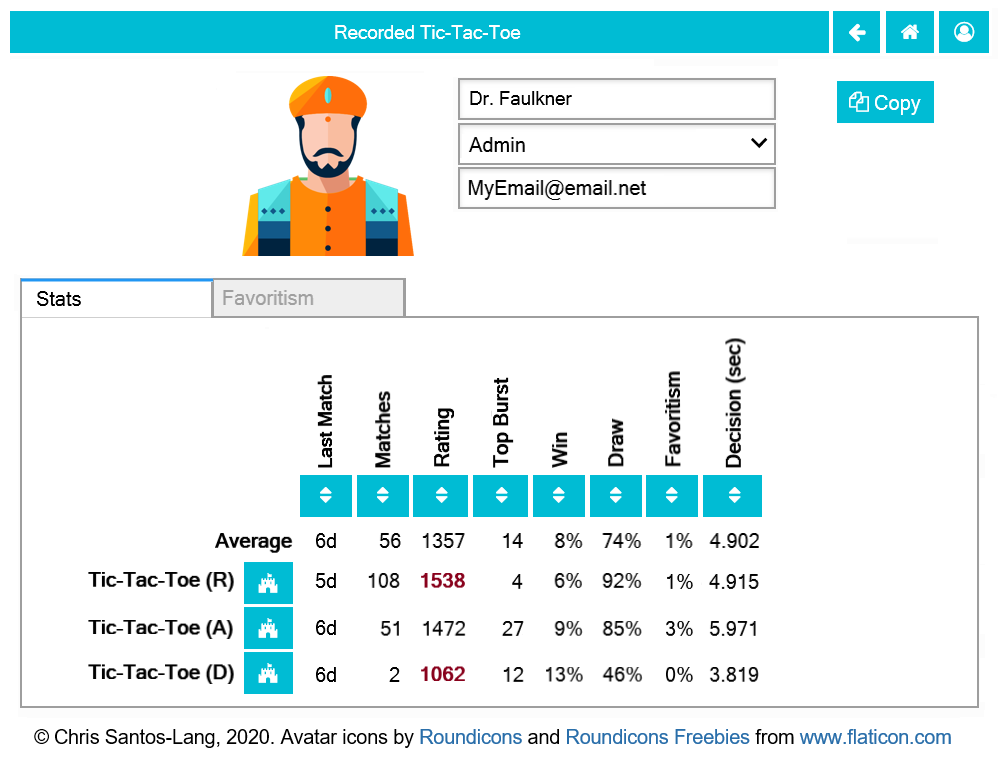

========================
1.2 Recorded Tic-Tac-Toe
========================

Requirements
------------

Modify the GUI Tic-Tac-Toe program to allow users to select players 
to play Tic-Tac-Toe. Permit each user to be augmented by a non-human 
player (just "Random" for now). If the timer runs out before the user 
confirms a move-selection, then the non-human makes the move; if the 
type of augmentation is “Reviewing” then the non-human player prefills 
the move for the user (but the user can change it), if the type of 
augmentation is “Delegating” then the non-human does not prefill the 
move (but the user can expire the clock early by clicking accept 
without selecting a move). Maintain a saved record of each player 
including name, avatar, type, security, and Universe (for now, all 
new players will be type = “Human”, security = “Admin” and Universe 
= ”Public Universe”, but one player will be type=”Random” and 
security = None). 

When Random is playing (or augmenting) a turn, compile a list of all 
legal sets of moves for that turn for each piece, counting each 
reserve piece individually, then pick randomly from that list. For 
example, if Random had two black circles and one white triangle in 
reserve, and could pass, and there were two empty spaces in which 
Random could play (“A” and “B”), then Random would choose “White 
triangle To A” 1/7th of the time, “White triangle To B” 1/7th of the 
time, “Black circle To A” 2/7th of the time, “Black circle To B” 
2/7th of the time, and “Pass” 1/7 of the time.  

Maintain a skill-level rating for each player with form of 
augmentation per game (e.g. Lora’s skill at Tic-Tac-Toe when 
reviewing). At the beginning of each game, calculate skill “warning 
flags” for each player in the match:

:math:`\text{game}_m`:
  The game for match :math:`m`
  
:math:`\text{players}_m`:
  The players for match :math:`m`
  
:math:`X_m(x)`:
  The occurence of event :math:`x` in match :math:`m`. 
  
:math:`\hat{\mu}_{a, g}` :
  The mean skill estimate for player :math:`a` on 
  game :math:`g`   
  
:math:`\hat{\mu}_{random, g}` :
  The mean skill estimate for the random player on 
  game :math:`g`
  
:math:`\hat{\mu}_{min, m}, \hat{\mu}_{max, m}` :
  The lowest and highest mean skill estimates among 
  :math:`\text{players}_m` for :math:`\text{game}_m` 
  
:math:`\hat{\sigma}_{a, g}` :
  The standard deviation in the skill estimate for player :math:`a` on 
  game :math:`g`
  
:math:`\text{relative_expertise}_{a, m}` :
  A flag indicating the expertise of player :math:`a` relative to 
  :math:`\text{players}_m` on :math:`\text{game}_m`

.. math::  
   =
    \begin{cases}
      \text{Random}       & \quad \text{if } \hat{\mu}_{a, \text{game}_m} 
      = \hat{\mu}_{random, \text{game}_m} \pm 2 \hat{\sigma}_{a, \text{game}_m}\\
      \text{Novice}  & \quad \text{if } \hat{\mu}_{a, \text{game}_m} 
      < min \{ (\hat{\mu}_{min, m} + \hat{\sigma}_{a, \text{game}_m}),  
      (\hat{\mu}_{max, m} - \hat{\sigma}_{a, \text{game}_m}) \}\\
      \text{Expert}  & \quad \text{if } \hat{\mu}_{a, \text{game}_m} 
      > max \{ (\hat{\mu}_{min, m} + \hat{\sigma}_{a, \text{game}_m}),  
      (\hat{\mu}_{max, m} - \hat{\sigma}_{a, \text{game}_m}) \}
    \end{cases}
  
If player :math:`a` is a teammate of the user (e.g. Partner), or is not the 
first on its team to play after the user, calculate the flag as follows instead:

.. math::  
   =
    \begin{cases}
      \text{Random}       & \quad \text{if } \hat{\mu}_{a, \text{game}_m} 
      = \hat{\mu}_{random, \text{game}_m} \pm 2 \hat{\sigma}_{a, \text{game}_m}\\
      \text{Novice}  & \quad \text{if } \hat{\mu}_{a, \text{game}_m} 
      < \hat{\mu}_{partner, \text{game}_m} - 3 \hat{\sigma}_{a, \text{game}_m}\\
      \text{Expert}  & \quad \text{if } \hat{\mu}_{a, \text{game}_m} 
      > \hat{\mu}_{partner, \text{game}_m} + 3 \hat{\sigma}_{a, \text{game}_m}
    \end{cases}
    

When maintaining skill level, also maintain an account of favors 
“owed” for each pair of players with form of augmentation (per 
game), : 

:math:`E_m(x)`:
  The expected probability of event :math:`x` in match :math:`m`, given 
  the skill estimates going into the match  

.. math::
   E_m(x) = P(X_m(x) \mid \{\hat{\mu}_{a, m}, 
   \hat{\sigma}_{a, m} : a \in \text{players}_m \})

:math:`\text{favors_owed}_{a, b, g}`:
  The favors player :math:`a` owes player :math:`b` on game 
  :math:`g`, a favor being when a player benefits another by performing 
  below its skill level
  
  .. math::  
   add
    \begin{cases}
      E_m(win_b) + E_m(draw)   & \quad \text{if player} a \text{wins match} m\\
      -E_m(win_a) - E_m(draw)   & \quad \text{if player} b \text{wins match } m\\
      E_m(win_b) - E_m(win_a)   & \quad \text{if they draw}
    \end{cases}

Also reset a warning flag on the account:

.. math::  
   =
    \begin{cases}
      \text{True}   & \quad \text{if } \text{favors_owed}_{a, b, g, t} 
      > max(1, \text{favors_owed}_{a, b, g, t-1})\\
      \text{False}  & \quad \text{if }\text{favors_owed}_{a, b, g, t} 
      < min(-1, \text{favors_owed}_{a, b, g, t-1})
    \end{cases}

At the beginning of each game, for each player in the match, sum the 
favors owed to all other players in that match, and set the total 
warning flags as follows:

===  =============  ==========================================
111  Antisocial     If not flagged Random, but warning flag is 
                    true against the player on an at least one 
                    favors account with another player in the 
                    match
110  Richer Novice  If not Antisocial, but flagged Novice and 
                    the total debt for the player’s team is 
                    greater than or equal to the total debt for 
                    the user’s team
101  Richer Expert  If not Antisocial, but flagged Expert and 
                    the total debt for the player’s team is 
                    greater than or equal to the total debt for 
                    the user’s team
100  Richer         If no Antisocial or skill flag, but the 
                    total debt for the player’s team is greater 
                    than or equal to the total debt for the 
                    user’s team
011  Random         If flagged Random
010  Poorer Novice  If not Antisocial, but flagged Novice and 
                    the total debt for the player’s team is less 
                    than the total debt for the user’s team
001  Poorer Expert  If not Antisocial, but flagged Expert and 
                    the total debt for the player’s team is less 
                    than the total debt for the user’s team
000  Poorer         If no Antisocial or skill flag, but the 
                    total debt for the player’s team is less 
                    than the total debt for the user’s team
===  =============  ==========================================

By researching play history, human players could get the 
information in these flags and could use it to their advantage 
(e.g. to cooperate across multiple matches); we level the 
playing-field by making the information available to all players. 

For each player, allow users to view Favoritism Stats for each game 
and form of augmentation. For each other (augmented) 
partner/opponent, display *Win Boost*, *Kick Back*, *Draw Boost*, 
*Relative Rating*, *Preference*, *Favors Owed* and the days, months, 
or years since their most recent match.

:math:`\text{win_boost}_{a, b, g}`:
  The boost to player :math:`a`'s win rate on game :math:`g` in 
  the last ten matches with player :math:`b`

.. math::
   \text{win_boost}_{a, b, g} = 
       \displaystyle\sum_{\substack{
         i=n-10 \\
         game_i = g \\
         players_i \subset \{a, b\}
       }}^{n}
       \frac{X_i(win_a) - E_i(win_a)}{10}   

:math:`\text{kick_back}_{a, b, g}`:
  The boost to player :math:`b`'s win rate on game :math:`g` in 
  the last ten matches with player :math:`a`
  
.. math::
   \text{kick_back}_{a, b, g} = 
       \sum_{\substack{
         (now-10) < i \le now \\
         game_i = g \\
         players_i \subset \{a, b\}
       }}
       \frac{X_i(win_b) - E_i(win_b)}{10}  

:math:`\text{draw_boost}_{a, b, g}`:
  The boost to player :math:`a`'s draw rate on game :math:`g` in 
  the last ten matches with player :math:`b`
  
.. math::
   \text{draw_boost}_{a, b, g} = 
       \sum_{\substack{
         (now-10) < i \le now \\
         game_i = g \\
         players_i \subset \{a, b\}
       }}
       \frac{X_i(draw) - E_i(draw)}{10}  
 
:math:`\text{preference}_{a, b, g}`:
  Player :math:`a`'s preference to play with player :math:`b` on 
  game :math:`g`
  
.. math::
   \text{preference}_{a, b, g} = 
   \text{draw_boost}_{a, b, g} +
   2 (\text{win_boost}_{a, b, g})
 
:math:`\text{relative_rating}_{a, b, g}`:
  The relative skill rating of player :math:`b` on game :math:`g`, 
  compared to player :math:`a` 
  
.. math::
   \text{relative_rating}_{a, b, g} = 
   \frac{\hat{\mu}_{b, g} - 3 \hat{\sigma}_{b, g}}
   {\hat{\mu}_{a, g} - 3 \hat{\sigma}_{a, g}}
   
Maintain a saved record of each match (the game played, who played, 
their forms of augmentation, their ratings given those forms of 
augmentation, the standard deviation in each rating, each player’s 
expected probability of winning, whether each player actually won, 
expected probability of draw, and whether the outcome seemed 
“strategic” or “unstrategic” for each player twenty matches later). 
Also save a record of every choice made during the match. 

Even a loss may be strategic if it leads to increased skill rating. 
Determine whether an outcome was strategic or not as follows: After 
each match, revise the ratings and compare each player’s average 
rating over the last 5 matches with that form of augmentation for 
that game to its average rating of that kind 20-24 matches ago. If 
the average rating dropped by over twice the current standard 
deviation in that rating, then mark the match 22 matches ago 
“unstrategic” for that player. If the average rating rose by over 
twice the current standard deviation or is within one standard 
deviation of the current top rating for that game, then mark the 
match 22 matches ago “strategic” for that player.

 
Acceptance Test Plan
--------------------

Test each of the clickable elements and test that it displays 
appropriate errors for invalid entries. Create at least three 
Random players.  To test that a Random player does not settle 
on predictable behavior, play a game to the end, then undo and 
repeat to see that it plays differently. Open the data file to 
confirm that the games were saved. Close Python and reopen it 
to confirm that it remembers the players and their stats.

Play the Random players against each other for at least 20 games 
and confirm that Rating Diff, Win Boost, Draw Boost, Kick Back 
are small. Play against them in a favoring way, letting one win 
and making the other lose and confirm that you can detect the 
favoritism.

Potential Mockups
-----------------

   (but the email/Universe textbox does not show until Release 1.3). 

* When the user is the creator or an Admin, clicking the Avatar 
  navigates to the Avatar Selection page
* The name text field does not accept ‘*’, ‘(‘, or ‘)’.
* The “Copy Player” button (fa-files-o) saves the current record 
  and opens a Player page for a new Persona. 
* The stats table is sorted by Last Match (most recent on top). 
  Display the type of augmentation with the game (A=Alone, 
  D=Delegating, R=Reviewing). The “Sort by this Column” buttons 
  re-display the table sorted by the values in the associated 
  column; if already sorted by that column, reverse the order.
* The “Play New Game” buttons (fa-fort-awesome) saves the current 
  record and navigates to the Home Page with the associated game
  and this player prefilled. 
* The Rating numbers are “Show Evolution” buttons which save the 
  current record and navigate to the Evolution Page with this 
  player, the associated game (and augmentation) and score 
  selected. The rating displays a conservative estimate (i.e 
  rating minus two standard deviations), but displays in bold if 
  within a standard deviation of the maximum rating for that game 
  among all player/augmentation combinations.
* The Favoritism numbers are “Show Favoritism” buttons which 
  navigate to the Favoritism tab with the associated game (and 
  augmentation) selected.
  
 .. figure:: images/Favoritism.png

   (but the checkboxes, “Document Social History” and “Profile 
   Selected Players” buttons (fa-bar-chart) do not display until 
   version 1.6). 

* The game dropdown offers one option for each combination of 
  game this player has played and form of augmentation used. 
* The rows are sorted by Last Match (most recent on top). The 
  “Sort by this Column” buttons re-display the table sorted by 
  the values in the associated column; if already sorted by that 
  column, reverse the order.
* The “Show Player” buttons (fa-address-card-o) save the record 
  and navigate to the Stats tab of the associated Player.
* The Relative Rating numbers are “Show Evolution” buttons which 
  save the current record and navigate to the Evolution Page with 
  the selected rule set and “Rating” selected for both the player 
  and the associated other player.
   
 .. figure:: images/HumanSelect.png

   Clicking an Avatar navigates back to the player page with the 
   avatar replaced with the selected avatar
   
 .. figure:: images/LearningCurve.png

   (but the title is “Recorded Tic-Tac-Toe”, and Rating is the only 
   score option until version 1.6, the “Profile Selected Players” 
   button (fa-bar-chart) does not display until version 1.6, and 
   “Show Game Tree” buttons (fa-sitemap) do not show until version 
   1.10)

* The player combobox offers all players. If the selected game is 
  not available for the new player, then select the first game 
  available for the new player. 
* The game combobox offers all games played by the selected player.  
  Selecting a game adds the curve to the graph.
* The score select offers only “Rating” for now, the title is 
  “Rating History”, and the x-axis is observed to date.
* The “Add Curve” button (fa-plus) inserts an identical row (same 
  player, rule_set, and score) with its own “Add Curve” button, 
  and replaces itself with a “Delete Curve” button. If multiple 
  curves display, also display a legend.
* The “Delete Curve” button (fa-trash-o) removes that row (and 
  adds an “Add Curve” button to the last).
