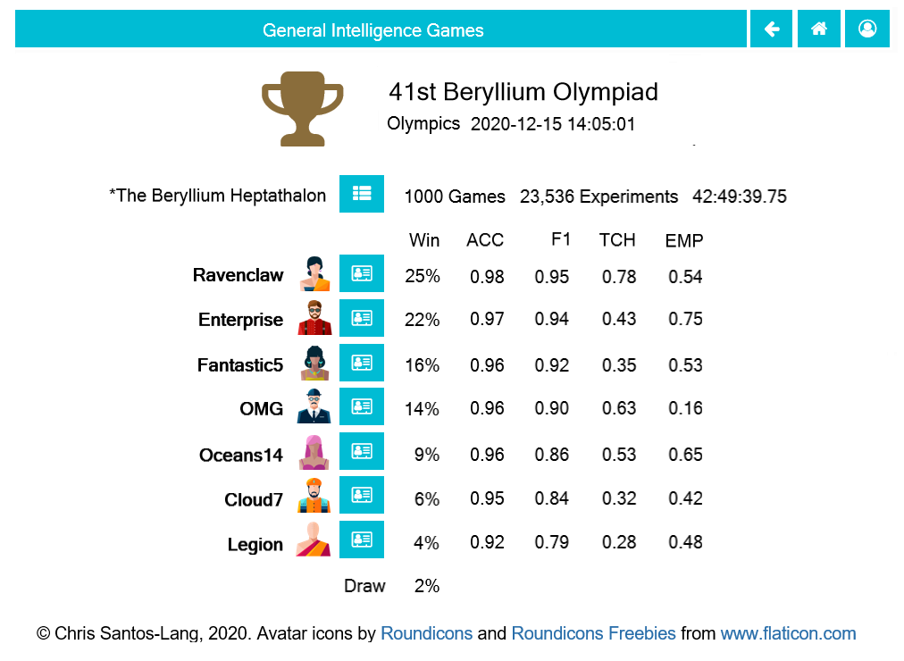

================
Tournament Pages
================

Tournaments are for non-human players (they involve many more matches 
than human stamina would permit). They are experiments to confirm 
which non-human player is better than another at a specific event or 
in general (i.e. for the most comprehensive Olympics_).  

Click on a **Tournament** button |tournamentbutton| to launch the page 
for that tournament: 

.. _Olympics:
Olympics are games composed of diverse events which no competitor
has ever encountered before. Rather than play an Olympic event 
directly, a player must copy itself, the copy plays (although the
outcomes impact the skill-level of the original), and the copy can never 
play again. That prevents players from mastering Olympic events in
advance--all competitors are in a race to develop new mastery--so 
Olympic champions are the players most likely to succeed when facing 
novel situations. 

Trainers can create a new tournament from a :doc:`Leaderboard <game>` or 
:doc:`Favoritism Tab <player>`, using the checkboxes to to select players. Special
security is required because a very complicated tournament could take 
days to run.  

